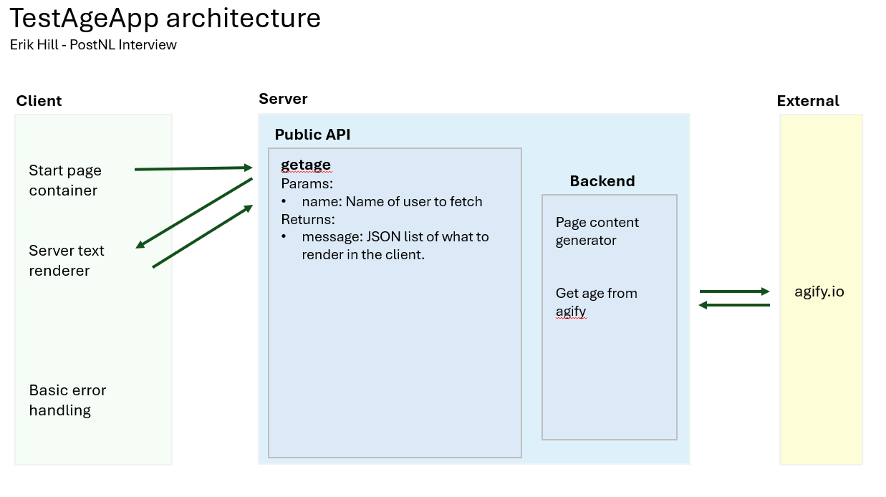

# TestAgeApp

## Description

A simple app for guessing a user's age.

This is built on React-Native for the frontend and C#/AWS for the backend

## Architecture

The frontend retrieves content from the backend to display.

The current divides displayed content mostly on the backend, while the front end would hold code that is run.
It is best to not send code to be executed remotely on the user device, so the backend would just reference existing functions.

### Relevant code for the coding assignment

- Frontend: see `testageapp\frontend\test-age\app`
- Backend: see `testageapp\testback\src\AgeGetter`

### What would be done in the future

- There would need to be either more than one API to call and/or more settings need to be added to it so it can handle more pages with more states.
- More robust content lines returned from the backend (depending on the app design).
- Testing, localization, error display on client, etc.

## Requirements

- Node.js (built with Node.js 24, but project can be downgraded)
- Expo
- Docker
- AWS (AWS CLI and SAM CLI)

## How To Run

### Frontend

- navigate to `testageapp\frontend\test-age\app` and run `npm run web`
- For testing without calls to the backend, set `fakeApiResponse` in DataLoader.tsx to `true` to use cached responses.

### Backend

- navigate to `testageapp\testback`
- build with `sam build`
- run with `sam local start-api`
- You can test the API from the browser, such as with `http://127.0.0.1:3000/getage?name=tammy`

## Links

[agify.io API](https://agify.io/documentation)
